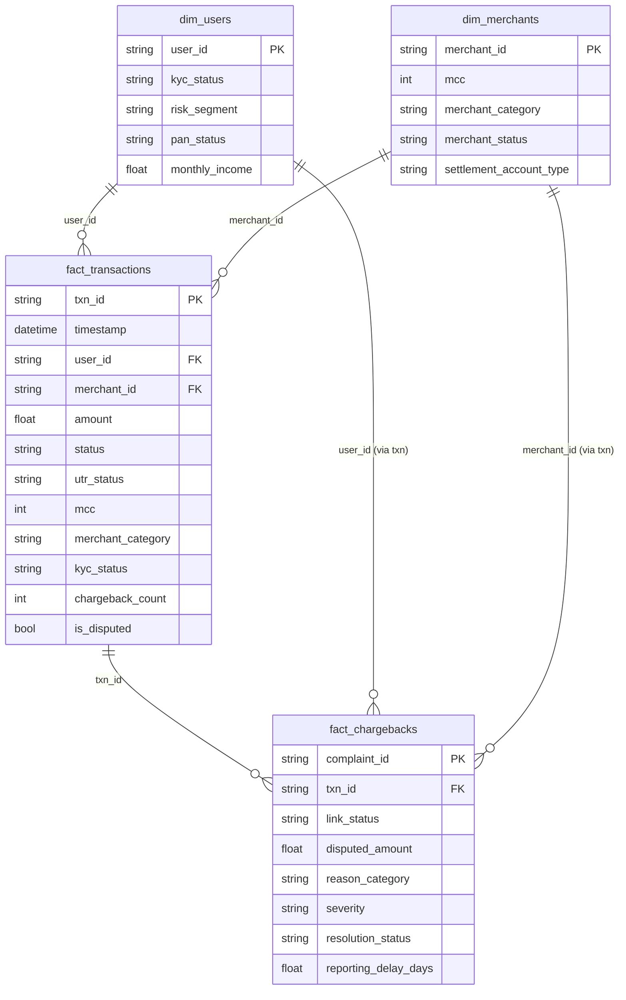

<div align="center">

# 🛡️ UPI Risk Desk

### UPI Fraud Ring Detection & Merchant Risk Analytics

An end-to-end analytics and risk-intelligence platform for detecting
fraud patterns, merchant risk, dispute clusters, and suspicious UPI
transaction behaviour.

[🚀 Dashboard](outputs/upi_risk_desk.html) · [📊 Analytics](src/analytics.py) · [🤖 Graph Agent](outputs/agent_demo.md) · [📁 Dataset](track1_dataset_notes.txt)


[](LICENSE)

</div>

---

## Track 1 — UPI Fraud Ring & Merchant Analytics

End-to-end solution for the TransOrg AgentIQ Datathon Track 1 bundle: cleaning four messy source systems,
linking them into an analytics-ready model, computing the fraud / dispute / merchant-risk metrics, a business
dashboard, and a graph-first query agent.

```
py -m pip install --user pandas networkx        # numpy comes with pandas
py src/clean.py            # 1. clean + standardise + build model  -> outputs/clean/, outputs/upi_analytics.db
py src/analytics.py        # 2. metrics, risk scores, clusters      -> outputs/metrics.json, outputs/risk/
py src/build_dashboard.py  # 3. dashboard                          -> outputs/upi_risk_desk.html
py src/agent.py --demo     # 4. graph agent on example queries     -> outputs/agent_demo.md
py src/agent.py --ask "Which merchant has the highest chargeback-to-transaction ratio?"
```

## Deliverables

| Path | What it is |
|---|---|
| `src/clean.py` | Tasks 1–11: all cleaning rules, data-quality log, star schema, SQLite model |
| `outputs/clean/fact_transactions.csv`, `fact_chargebacks.csv`, `dim_users.csv`, `dim_merchants.csv` | Analytics-ready tables (flags kept on every row) |
| `outputs/clean/kyc_all_records.csv`, `merchants_all_records.csv` | Every cleaned source record, including ID-collision losers |
| `outputs/upi_analytics.db` | Same model in SQLite, indexed, with `v_merchant_risk` and `v_category_disputes` views |
| `outputs/data_quality_report.csv` | 70 checks: what was wrong, how many rows, what was done |
| `src/analytics.py` → `outputs/metrics.json` | All business metrics (task 12 feed) |
| `outputs/risk/*.csv` | Analyst worklists: merchant & user risk scores, suspicious clusters, spikes, >7-day disputes, missing-UTR transactions |
| `outputs/upi_risk_desk.html` | Task 12 dashboard (self-contained, open in a browser): global filters, cross-filtering charts, drag-to-zoom, period stepper with prior-period KPI deltas, "filter page to this merchant/customer", browser-saved watchlist, shareable view links, keyboard shortcuts (`?`) |
| `src/agent.py`, `outputs/agent_demo.md` | Task 13 graph-first agent + answers to all example queries |

## 1. Cleaning strategy

Principle: **repair and flag, don't delete.** Rows are removed only when they are duplicates (which inflate
revenue and dispute ratios). Every other defect is fixed where the evidence supports a fix, otherwise nulled
and flagged, and counted in `data_quality_report.csv`.

| Area | Problem found | Rule applied |
|---|---|---|
| user_id | `USR12345, usr12345, USR-12345, USR 12345, usr_12345, 12345` | digits extracted → `USR#####` |
| merchant_id | `MCH1234, mch1234, MCH-1234, MCH 1234, 1234` | → `MCH####` |
| txn_id (chargebacks) | `TXN-00001234`, short `TXN12345` | → `TXN` + 8-digit zero pad; unmatched kept as `TXN_NOT_FOUND` |
| Amounts | `₹23,027.53`, `Rs. 6362.9`, `INR 22,268`, `27.3k`, `Not Available`, negatives | symbols/commas stripped, `k`×1000; text → null; negatives → absolute value + `*_was_negative` flag (no refund status exists, magnitudes match the positive distribution) |
| Timestamps | ISO, `YYYY/MM/DD`, `DD/MM/YYYY HH:MM[:SS] [AM]`, `MM-DD-YYYY hh:mm:ss AM`, `DD-Mon-YYYY`, epoch seconds (negative for DOBs) | **Day/month order proven from data**: across all four files no slash-date has a value >12 in position 2 and no dash-date has one in position 1 → slash = DD/MM, dash = MM-DD. Date-only values flagged `has_time=False` and excluded from hourly analysis |
| Status | `S, Success, TXN_SUCCESS, COMPLETED / F, Fail, Declined, TXN_FAILED / PENDING, PROCESSING, Initiated` | → `SUCCESS / FAILED / PENDING` |
| UTR | spaces, blanks | whitespace/hyphen stripped, validated `UTR\d{10}`; `utr_status = VALID / MISSING / INVALID` |
| PAN | spaces, hyphens, lower case, wrong shape | normalised, validated `AAAAA9999A`; invalid nulled with `pan_status` |
| Aadhaar | spaced/hyphenated, 10/13 digits, pre-masked `XXXX-XXXX-1234` | validated 12 digits; **only last 4 stored** (privacy); `aadhaar_status` |
| City | `Bombay, Mumbay, BLR, Bangalore, Dilli, New Delhi, Calcutta, Madras, LKO, Hyd…` | 41 spellings → 12 cities; city↔state consistency checked (0 conflicts) |
| KYC status | 16 variants | → `VERIFIED / PENDING / IN_REVIEW / REJECTED` |
| MCC / category | `MCC-7011, 07011, 5311.0, misc, NA`; 82 category spellings | MCC digits parsed; category→MCC mapping verified 1:1 from the data, so missing MCCs are inferred from the category; categories collapsed to 10 MCC-aligned names |
| Merchant status | `Active, Enabled, Live, A, Hold, S, Blocked…` | → `ACTIVE / INACTIVE / CLOSED / SUSPENDED / BLOCKED` |
| Chargeback enums | severity `P1–P4, H/M/L, CRIT`; resolution `WIP, Pending Bank…`; 34 reason spellings; channel case | canonical enums; reasons → 8 categories, 3 of them fraud-type |
| Complaint text | case, `cust`/`txn`, trailing `urgent / call dropped / NA` | normalised; trailing notes moved to `complaint_text_note` |
| Duplicates | 400 transaction rows, 84 complaints, 278 KYC rows, 12 merchant rows | removed (transactions would have added **₹51.9 L** of fake volume) |
| ID collisions | 6,288 KYC IDs and 1,412 merchant IDs map to several *different* people/businesses | all records kept in `*_all_records.csv`; the dimension keeps the most-recent, most-complete record; `id_record_count` flags the ambiguity |
| Orphan keys | 67.6% of transactions have no KYC user; 51.8% no master merchant; 193 complaints with missing/unknown txn_id | kept; `kyc_status = NO_KYC_RECORD`, category from the transaction MCC; unlinked complaints count in totals but never in ratios |
| Impossible values | DOB age ∉ [18,100], future signups/onboarding, dispute reported before payment, bank response before complaint | checked; 149 reported-before-payment delays nulled and flagged |

### Two judgement calls worth knowing

1. **Chargeback attribution goes through `txn_id`.** Every one of the 2,607 linked complaints carries a user_id and
   merchant_id that differ from the payment it disputes. The transaction is treated as the source of truth; the
   complaint's own IDs are kept as `reported_user_id / reported_merchant_id`. Computing merchant ratios on the
   complaint IDs would attribute disputes to the wrong merchants.
2. **Reporting delay uses the complaint's own transaction date.** Measured from the linked transaction's
   timestamp, 1,057 complaints would be "reported before the payment"; measured from the complaint's
   `transaction_timestamp` only 149 are, with a sensible distribution (median 3.2 days). The linked timestamp
   is retained as `linked_txn_timestamp`.

## 2. Data model



## 3. Business metrics (Jan 1 – Mar 31 2026)

| Metric | Value |
|---|---|
| Total transactions | 20,000 (after removing 400 duplicates) |
| Total transaction amount | ₹24.98 Cr (successful: ₹21.38 Cr) |
| Average transaction value | ₹12,489 |
| Failed / pending rate | 9.78% / 4.96% |
| Chargebacks | 2,800 complaints, ₹1.01 Cr disputed (2,607 linked to a transaction) |
| Chargeback-to-transaction ratio | **12.3%** of transactions (3.8% of value) |
| KYC completion / rejection rate | 77.4% / 8.2% of 28,920 customers |
| Average reporting delay | 8.0 days (median 3.2); 666 disputes reported after 7 days |
| High-risk merchants / users | 234 / 100 (plus 385 / 230 medium) |
| Suspicious clusters | 121 connected dispute rings (≥4 members) |

Dispute rate by merchant category (disputed transactions ÷ transactions — same definition as the overall ratio)
for the large books: Transportation 13.4%, Restaurants 12.8%, Grocery 12.4%, Hotels 11.6%, Pharmacy 11.5%.
Small books: Apparel 17.0% (n=147), Misc Retail 13.6% (n=132), Department Stores 13.5%, Telecom 9.3%, Books 8.3%.

## 4. Insights for the business

1. **The biggest control gap is identity, not fraud modelling.** 67.6% of payment value (₹16.95 Cr) comes from
   users with no KYC record, and 6,288 customer IDs resolve to more than one person. Fix onboarding and ID
   hygiene before tuning detection rules.
2. **Rejected-KYC customers are still transacting — and disputing more.** Dispute rate 15.0% for rejected users,
   14.0% in review, 13.2% verified, 8.9% pending. A rejected KYC should block or step-up UPI payments.
3. **One in eight payments is disputed; 37% of disputes are fraud-type** (account takeover, unauthorised,
   suspected fraud), and 53% are still open. Grocery carries the most money in dispute (₹29.4 L);
   Transportation has the worst ratio among the large categories.
4. **Risky merchants are often unregistered payees.** The top of the merchant risk list is dominated by
   merchants that are absent from the master or have no settlement account on file, with 3–5 disputes on
   3–5 payments. 381 merchants have ≥2 disputes.
5. **Rings are small and merchant-centred.** The graph finds 121 components where several disputing users share a
   few merchants — the largest links 6 users to 4 merchants with 8 chargebacks (4 fraud-type) and 4 unverified users.
6. **Delay tells a different story than expected.** Account takeovers are reported fastest (mean 6.8 d);
   duplicate debits are reported slowest (9.9 d), i.e. found on statements. Unauthorised transactions have the
   highest share reported after 7 days (27%) — the late-fraud-detection signal.
7. **"Duplicate debit" complaints are not backed by duplicate ledger entries.** 352 complaints claim a double
   debit, yet after de-duplication no user–merchant–amount repeats within 24 h remain — the duplication happened
   in the raw feed (400 rows) and would have inflated revenue by ₹51.9 L if not removed.
8. **Missing UTR is not a risk signal in this data.** 1,000 transactions (5%) lack a UTR; their failed rate
   (9.7% vs 9.8%) and dispute rate (12.6% vs 12.2%) match valid-UTR transactions.
9. **Failures are flat across the clock** (8–11% every hour, Sunday lowest at 8.8%), so the failure rate is a
   systemic issue rather than a peak-load or batch-window problem. Merchant-level spike-then-dispute behaviour
   is absent (2 spike days, no follow-on disputes) because merchant traffic is thin (≤10 payments a quarter).

## 5. Risk scoring

Transparent additive scores (≥50 high, 30–49 medium) so an analyst can see *why* each entity is flagged
(`risk_signals` column):

- **Merchant**: ≥2 disputes (+25), ≥3 (+10), chargeback ratio ≥30% on ≥3 payments (+15), any fraud-type dispute
  (+15), top-decile disputed amount (+10), spike followed by disputes (+10), transacting while not active (+10),
  not in master (+5), missing settlement account (+5).
- **User**: ≥2 disputes (+30), chargeback ≥ p90 amount ₹8,976 (+15), fraud-type dispute (+15), disputing with
  unverified KYC (+15) or no KYC record (+10), HIGH risk segment (+10), payments ≤30 min apart (+10),
  ≥2 failed payments (+5), disputed more than monthly income (+5).
- **Cluster**: 2×chargebacks + 3×fraud-type + unverified users + disputed ₹/10,000.

## 6. Graph-first agent

`src/agent.py` loads the model into a property graph (72k nodes, 106k edges):
`(User)-[:PAID]->(Transaction)-[:TO]->(Merchant)`, `(Transaction)-[:IN_CATEGORY]->(Category)`,
`(Transaction)-[:DISPUTED_BY]->(Chargeback)-[:HAS_REASON]->(Reason)`, `(User)-[:HAS_KYC]->(KycStatus)`.
Every answer is a traversal of that graph. A deterministic intent router maps questions to graph queries (all
12 example queries plus ring detection and `MCH####` / `USR#####` lookups); an LLM router can replace it
without touching the query layer. Output for every example question is in `outputs/agent_demo.md`.

## Assumptions & limitations

- Data is synthetic; ratios such as a 12% chargeback rate are far above real UPI levels and are reported as-is.
- Negative amounts are treated as sign errors, not refunds, because no refund status or reversal reference exists.
- Epoch timestamps are read as naive (UTC) seconds; this keeps them inside the same Jan–Mar window as the text dates.
- Small categories (<200 transactions) and merchants with <3 payments are shown but should not drive decisions alone.
